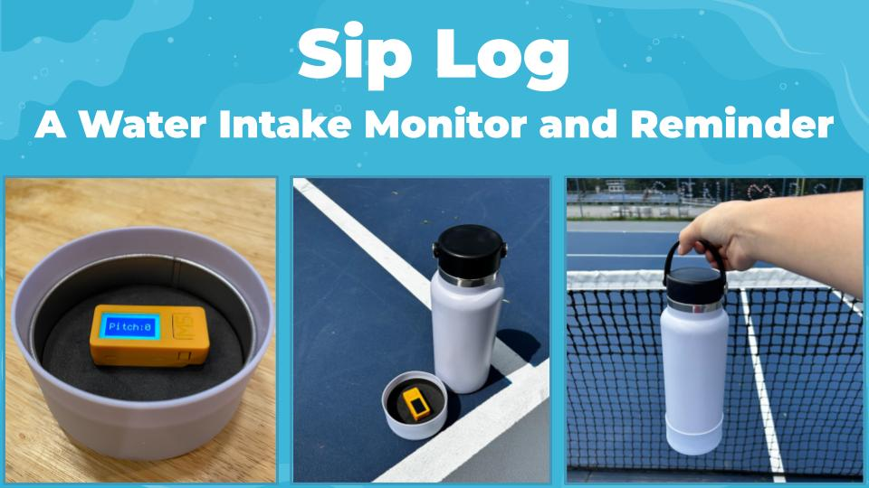

  

Sip Log is a mobile device that computerizes a water bottle to monitor water intake during physical activity. Attached to the bottom of a bottle, it keeps track of water intakes, records intake logs in the cloud, helps estimate water consumption, and issues hydration reminders via smartphone notifications. It aims to aid athletes be more aware of their water intake and prevent dehydration, which affects their condition and performance. Sip Log uses a battery-operated ESP32 microcontroller that runs CircuitPython code to detect water intake with a 3-axis accelerometer and interact with the cloud with WiFi. 

This project was presented at [PhysTech 2025](https://phystech2025.devpost.com/). It won a [3rd place](https://phystech2025.devpost.com/project-gallery) award.

### Publications:

Hanna Suzuki, "Sip Log: A Mobile Water Intake Monitor and Reminder," In R. Nagata, H. Suzuki and S. Nagata (eds.), Innovation in Motion: Technology Hacks from PhysTech 2025, Chapter 2, Binnovative, September 2025.
    
### Key Features:

- Tilt sensing: Continuously sensing the tilt of a water bottle with an accelerometer
- Water intake detection: Detecting water intake when the tilt of the bottle is greater than 45 degrees. 
- Water intake logging: Recording water intake log in a cloud database (Kintone).
- Analyzing water intake log: Graphing intake log and estimating hourly/daily intake.
- Hydration reminder: Sending reminders to a phone.

https://github.com/user-attachments/assets/15ccf750-053a-40fd-bcab-b142b7625c75

